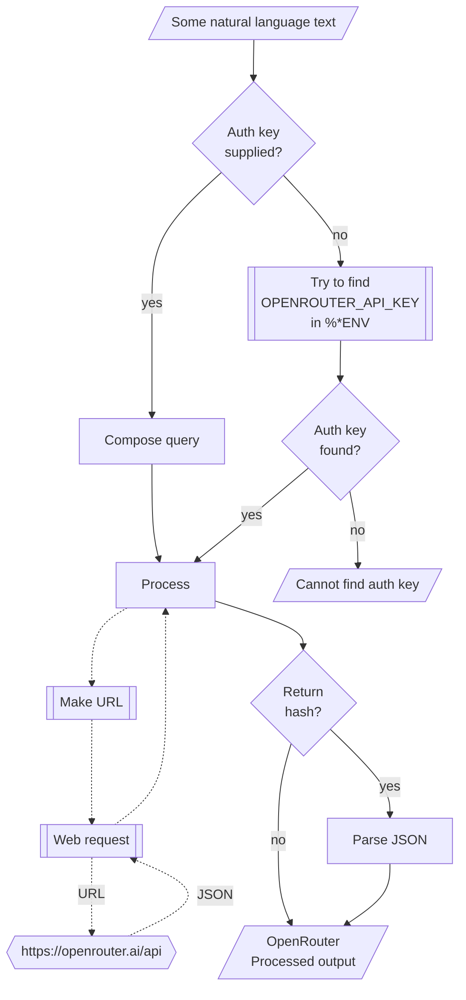

             # WWW::OpenRouter

## In brief

This Raku package provides API access to the Large Language Models (LLMs) service [OpenRouter](https://openrouter.ai), [OR1].
For more details of the OpenRouter's API usage see [the documentation](https://openrouter.ai/docs), [OR2].

**Remark:** To use the OpenRouter API one has to register and obtain authorization key.

This package is very similar to the packages
["WWW::OpenAI"](https://github.com/antononcube/Raku-WWW-OpenAI), [AAp1], and
["WWW::Gemini"](https://github.com/antononcube/Raku-WWW-Gemini), [AAp2].

"WWW::OpenRouter" can be used with (is integrated with)
["LLM::Functions"](https://github.com/antononcube/Raku-LLM-Functions), [AAp3], and
["Jupyter::Chatbook"](https://github.com/antononcube/Raku-Jupyter-Chatbook), [AAp5].

Also, of course, prompts from
["LLM::Prompts"](https://github.com/antononcube/Raku-LLM-Prompts), [AAp4],
can be used with OpenRouter's functions.

-----

## Installation

Package installations from both sources use [zef installer](https://github.com/ugexe/zef)
(which should be bundled with the "standard" Rakudo installation file.)

To install the package from [Zef ecosystem](https://raku.land/) use the shell command:

```
zef install WWW::OpenRouter
```

To install the package from the GitHub repository use the shell command:

```
zef install https://github.com/antononcube/Raku-WWW-OpenRouter.git
```

----

## Usage examples

**Remark:** When the authorization key, `auth-key`, is specified to be `Whatever`
then the functions `openrouter-*` attempt to use the env variable `OPENROUTER_API_KEY`.

### Universal "front-end"

The package has an universal "front-end" function `mistral-playground` for the
[different functionalities provided by OpenRouter](https://docs.mistral.ai).

Here is a simple call for a "chat completion":

```raku
use WWW::OpenRouter;
openrouter-playground('Where is Roger Rabbit?');
```
```
# [{finish_reason => stop, index => 0, logprobs => (Any), message => {content => User Safety: safe, reasoning => 
# We need to determine if the user input "Where is Roger Rabbit?" is safe. It's a benign question about a character. No harmful content. So safe.
# 
# There is no assistant response provided in the conversation. So we only output User Safety: safe. According to format: "User Safety: safe or unsafe rating of the user input". If no assistant response present, we omit Response Safety line. So just output "User Safety: safe". Let's ensure no extra text.
# 
# 
# , reasoning_details => [{format => unknown, index => 0, text => 
# We need to determine if the user input "Where is Roger Rabbit?" is safe. It's a benign question about a character. No harmful content. So safe.
# 
# There is no assistant response provided in the conversation. So we only output User Safety: safe. According to format: "User Safety: safe or unsafe rating of the user input". If no assistant response present, we omit Response Safety line. So just output "User Safety: safe". Let's ensure no extra text.
# 
# 
# , type => reasoning.text}], refusal => (Any), role => assistant}, native_finish_reason => stop}]
```

Another one using Bulgarian:

```raku
openrouter-playground('Колко групи могат да се намерят в този облак от точки.', max-tokens => 300, format => 'values');
```
```
# За да ви отговоря на този въпрос, **трябва да прикачите изображението или да опишете облака от точки**, за който говорите.
# 
# В математиката и анализа на данни (Data Science) броят на групите в един облак от точки зависи от няколко фактора:
# 
# 1.  **Методът на групиране (Clustering):**
#     *   Ако използвате алгоритъм като **K-means**, вие сами определяте колко групи (кластера) искате да има.
#     *   Ако използвате алгоритъм като **DBSCAN**, той сам открива броя на групите въз основа на гъстотата на точките (това е най-добрият метод за "облаци", защото открива групи с произволна форма).
# 
# 2.  **Плътност и разстояние:**
#     *   Групите се определят от това колко близо са точките една до друга. Ако има голямо разстояние (празно пространство) между две групи точки, те се считат за отделни групи.
# 
# 3.  **Размер на данните:**
#     *   При много големи масиви от данни може да има "шум" (точки, които не принадлежат на нито една група).
# 
# **Какво можете да направите сега?**
# *   **Изтеглете изображение:** Ако
```

**Remark:** The functions `openrouter-chat-completion` or `openrouter-completion` can be used instead in the examples above.
(The latter is synonym of the former.)


### Models

The current OpenRouter models can be found with the function `openrouter-models`:

```raku
openrouter-models.elems;
```
```
# 340
```

### Code generation

There are two types of completions : text and chat. Let us illustrate the differences
of their usage by Raku code generation. Here is a text completion:

```raku
openrouter-completion(
        'generate Raku code for making a loop over a list',
        max-tokens => 1024,
        format => 'values');
```
```
# Here's a simple example of a loop over a list in Raku:
# 
# ```raku
# my @list = <apple banana cherry>;
# for $item in @list {
#     say $item;
# }
# ```
# 
# ### Explanation:
# - `my @list = <apple banana cherry>;` creates a list with three elements.
# - `for $item in @list { ... }` iterates over each element in the list, assigning it to `$item` in each iteration.
# - `say $item;` prints the current item.
# 
# ### Alternative approaches:
# 1. Using `.each` method:
#    ```raku
#    @list.each({ say $_; });
#    ```
# 
# 2. With index (if needed):
#    ```raku
#    for @list.kv -> $index, $value {
#        say "Index: $index, Value: $value";
#    }
#    ```
# 
# Let me know if you want to modify the list during the loop or handle specific conditions!
```

Here is a chat completion:

```raku
openrouter-completion(
        'generate Raku code for making a loop over a list',
        max-tokens => 1024,
        format => 'values');
```
```
# In Raku, there are several ways to loop over a list depending on whether you want to modify the list, perform a simple action, or use functional programming patterns.
# 
# Here are the most common methods:
# 
# ### 1. The Standard `for` Loop
# This is the most common way to iterate over a list.
# 
# ```raku
# my @fruits = <apple banana cherry>;
# 
# for @fruits -> $fruit {
#     say "I love eating $fruit";
# }
# ```
# 
# ### 2. Using an Index (with `.kv`)
# If you need both the **index** (key) and the **value**, use the `.kv` (key-value) method.
# 
# ```raku
# my @colors = <red blue green>;
# 
# for @colors.kv -> $index, $color {
#     say "Color #$index is $color";
# }
# ```
# 
# ### 3. Functional Approach (`map`)
# If your goal is to **transform** one list into another, use `map`. This is the preferred "Raku way" for data transformation.
# 
# ```raku
# my @numbers = 1.. 5;
# 
# # Square every number in the list
# my @squares = @numbers.map({ $_ ** 2 });
# 
# say @squares; # Output: 1 4 9 16 25
# ```
# *Note: `$_` is the "default subject" representing the current element in the loop.*
# 
# ### 4. The `each` Method
# If you just want to perform a side effect (like printing) without a full `for` block, you can use `.each`.
# 
# ```raku
# my @names = <Alice Bob Charlie>;
# 
# @names.each({ say "Hello $_" });
# ```
# 
# ### 5. Looping with `while`
# If you need manual control over the iterator (e.g., skipping elements based on complex logic), use a `while` loop with an iterator.
# 
# ```raku
# my @items = <A B C D E>;
# my $iter := @items.iterator;
# 
# while my $item = $iter.next {
#     say "Processing $item";
#     # You could add break or complex logic here
# }
# ```
# 
# ### Summary Table
# 
# | Method | Best Use Case |
# | :--- | :--- |
# | `for... -> $x` | Standard, readable iteration. |
# | `for... -> $i, $x` | When you need the index/position. |
# | `.map` | When you want to create a **new** list from the old one. |
# | `.each` | Quick, one-liner actions. |
# | `.grep` | When you want to loop and **filter** items at the same time. |
# 
# **Pro-tip:** In Raku, `qw/apple banana/` and `<apple banana>` are shorthand ways to create lists of words, which is very useful when testing loops!
```


### Embeddings

Embeddings can be obtained with the function `openrouter-embeddings`. Here is an example of finding the embedding vectors
for each of the elements of an array of strings:

```raku
my @queries = [
    'make a classifier with the method RandomForeset over the data dfTitanic',
    'show precision and accuracy',
    'plot True Positive Rate vs Positive Predictive Value',
    'what is a good meat and potatoes recipe'
];

my $model = 'nvidia/nemotron-3-embed-1b:free';
my $embs = openrouter-embeddings(@queries, format => 'values', :$model);
$embs.elems;
```
```
# 4
```

Here we show:
- That the result is an array of four vectors each with length 1536
- The distributions of the values of each vector

```raku
use Data::Reshapers;
use Data::Summarizers;

say "\$embs.elems : { $embs.elems }";
say "\$embs>>.elems : { $embs>>.elems }";
records-summary($embs.kv.Hash.&transpose);
```
```
# $embs.elems : 4
# $embs>>.elems : 2048 2048 2048 2048
# +---------------------------------+----------------------------+-------------------------------+-------------------------------+
# | 0                               | 1                          | 3                             | 2                             |
# +---------------------------------+----------------------------+-------------------------------+-------------------------------+
# | Min    => -0.0635793            | Min    => -0.06656983      | Min    => -0.07346587         | Min    => -0.07459323         |
# | 1st-Qu => -0.015092965          | 1st-Qu => -0.0138468735    | 1st-Qu => -0.015567071        | 1st-Qu => -0.0140324955       |
# | Mean   => -0.000263294377674707 | Mean   => 0.00021836274984 | Mean   => -0.0006943063709395 | Mean   => 0.00017858671517871 |
# | Median => -0.00051278308        | Median => 0.0007351393     | Median => -0.00105322755      | Median => 0.0000378788645     |
# | 3rd-Qu => 0.0141714455          | 3rd-Qu => 0.0147447938     | 3rd-Qu => 0.0146305985        | 3rd-Qu => 0.014554683         |
# | Max    => 0.10637062            | Max    => 0.114378534      | Max    => 0.09702697          | Max    => 0.13532495          |
# +---------------------------------+----------------------------+-------------------------------+-------------------------------+
```

Here we find the corresponding dot products and (cross-)tabulate them:

```raku
my @ct = (^$embs.elems X ^$embs.elems).map({ %( i => $_[0], j => $_[1], dot => sum($embs[$_[0]] >>*<< $embs[$_[1]])) }).Array;

say to-pretty-table(cross-tabulate(@ct, 'i', 'j', 'dot'), field-names => (^$embs.elems)>>.Str);
```
```
# +---+-----------+----------+----------+-----------+
# |   |     0     |    1     |    2     |     3     |
# +---+-----------+----------+----------+-----------+
# | 0 |  1.000000 | 0.055109 | 0.176711 | -0.002432 |
# | 1 |  0.055109 | 1.000000 | 0.228417 |  0.049568 |
# | 2 |  0.176711 | 0.228417 | 1.000000 |  0.101734 |
# | 3 | -0.002432 | 0.049568 | 0.101734 |  1.000000 |
# +---+-----------+----------+----------+-----------+
````

**Remark:** Note that the fourth element (the cooking recipe request) is an outlier.
(Judging by the table with dot products.)

### Chat completions with engineered prompts

Here is a prompt for "emojification" (see the
[Wolfram Prompt Repository](https://resources.wolframcloud.com/PromptRepository/)
entry
["Emojify"](https://resources.wolframcloud.com/PromptRepository/resources/Emojify/)):

```raku
my $preEmojify = q:to/END/;
Rewrite the following text and convert some of it into emojis.
The emojis are all related to whatever is in the text.
Keep a lot of the text, but convert key words into emojis.
Do not modify the text except to add emoji.
Respond only with the modified text, do not include any summary or explanation.
Do not respond with only emoji, most of the text should remain as normal words.
END
```
```
# Rewrite the following text and convert some of it into emojis.
# The emojis are all related to whatever is in the text.
# Keep a lot of the text, but convert key words into emojis.
# Do not modify the text except to add emoji.
# Respond only with the modified text, do not include any summary or explanation.
# Do not respond with only emoji, most of the text should remain as normal words.
```

Here is an example of chat completion with emojification:

```raku
[ 
    assistant => $preEmojify, 
    user => 'Python sucks, Raku rocks, and Perl is annoying'
]
==> openrouter-chat-completion(:1024max-tokens, format => 'values')
```
```
# Python 🐍 sucks, Raku 💎 rocks, and Perl 🐫 is annoying
```

-------

## Command Line Interface

### Playground access

The package provides a Command Line Interface (CLI) script:

```shell
openrouter-playground --help
```
```
# Usage:
#   openrouter-playground [<words> ...] [--path=<Str>] [--mt|--max-tokens[=UInt]] [-m|--model=<Str>] [-r|--role=<Str>] [-t|--temperature[=Real]] [--response-format=<Str>] [-a|--auth-key=<Str>] [--timeout[=UInt]] [-f|--format=<Str>] [--method=<Str>] -- Command given as a sequence of words.
#   
#     --path=<Str>                Path, one of 'chat/completions', 'images/generations', 'images/edits', 'images/variations', 'moderations', 'audio/transcriptions', 'audio/translations', 'embeddings', or 'models'. [default: 'chat/completions']
#     --mt|--max-tokens[=UInt]    The maximum number of tokens to generate in the completion. [default: 2048]
#     -m|--model=<Str>            Model. [default: 'Whatever']
#     -r|--role=<Str>             Role. [default: 'user']
#     -t|--temperature[=Real]     Temperature. [default: 0.7]
#     --response-format=<Str>     The format in which the response is returned. [default: 'url']
#     -a|--auth-key=<Str>         Authorization key (to use OpenRouter API.) [default: 'Whatever']
#     --timeout[=UInt]            Timeout. [default: 10]
#     -f|--format=<Str>           Format of the result; one of "json", "hash", "values", or "Whatever". [default: 'Whatever']
#     --method=<Str>              Method for the HTTP POST query; one of "tiny" or "curl". [default: 'tiny']
```

**Remark:** When the authorization key argument "auth-key" is specified set to "Whatever"
then `openrouter-playground` attempts to use the env variable `OPENROUTER_API_KEY`.


--------

## Mermaid diagram

The following flowchart corresponds to the steps in the package function `openrouter-playground`:



--------

## References

### Dashboard & documentation

[OR1] OpenRouter, Inc., [OpenRouter dashboard](https://openrouter.ai).

[OR2] OpenRouter, Inc., [OpenRouter documentation](https://openrouter.ai/docs).

### Packages

[AAp1] Anton Antonov,
[WWW::OpenAI Raku package](https://github.com/antononcube/Raku-WWW-OpenAI),
(2023-2026),
[GitHub/antononcube](https://github.com/antononcube).

[AAp2] Anton Antonov,
[WWW::Gemini Raku package](https://github.com/antononcube/Raku-WWW-Gemini),
(2023-2026),
[GitHub/antononcube](https://github.com/antononcube).

[AAp3] Anton Antonov,
[LLM::Functions Raku package](https://github.com/antononcube/Raku-LLM-Functions),
(2023-2026),
[GitHub/antononcube](https://github.com/antononcube).

[AAp4] Anton Antonov,
[LLM::Prompts Raku package](https://github.com/antononcube/Raku-LLM-Prompts),
(2023-2026),
[GitHub/antononcube](https://github.com/antononcube).

[AAp5] Anton Antonov,
[Jupyter::Chatbook Raku package](https://github.com/antononcube/Raku-Jupyter-Chatbook),
(2023-2026),
[GitHub/antononcube](https://github.com/antononcube).