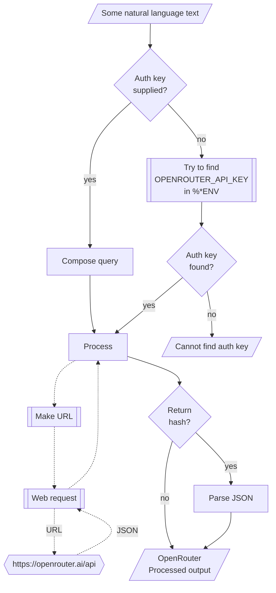

# WWW::OpenRouter

## In brief

This Raku package provides API access to the Large Language Models (LLMs) service [OpenRouter](https://openrouter.ai), [OR1].
For more details of the OpenRouter's API usage see [the documentation](https://openrouter.ai/docs), [OR2].

**Remark:** To use the OpenRouter API one has to register and obtain authorization key.

This package is very similar to the packages
["WWW::OpenAI"](https://github.com/antononcube/Raku-WWW-OpenAI), [AAp1], and
["WWW::Gemini"](https://github.com/antononcube/Raku-WWW-Gemini), [AAp2].

"WWW::OpenRouter" can be used with (is integrated with)
["LLM::Functions"](https://github.com/antononcube/Raku-LLM-Functions), [AAp3], and
["Jupyter::Chatbook"](https://github.com/antononcube/Raku-Jupyter-Chatbook), [AAp5].

Also, of course, prompts from
["LLM::Prompts"](https://github.com/antononcube/Raku-LLM-Prompts), [AAp4],
can be used with OpenRouter's functions.

-----

## Installation

Package installations from both sources use [zef installer](https://github.com/ugexe/zef)
(which should be bundled with the "standard" Rakudo installation file.)

To install the package from [Zef ecosystem](https://raku.land/) use the shell command:

```
zef install WWW::OpenRouter
```

To install the package from the GitHub repository use the shell command:

```
zef install https://github.com/antononcube/Raku-WWW-OpenRouter.git
```

---

## Universal "front-end"

The package has an universal "front-end" function `openrouter-playground` for the
[different functionalities provided by OpenRouter](https://openrouter.ai/docs).

Here is a simple call for a "chat completion":

```raku
use WWW::OpenRouter;
openrouter-playground('Where is Roger Rabbit?');
```
```
# [{finish_reason => stop, index => 0, logprobs => (Any), message => {content => Roger Rabbit is a fictional character from the 1988 film *Who Framed Roger Rabbit*, a live-action/animated hybrid movie. In the story, he is a cartoon rabbit who lives in the fictional city of **Dipper**, a 1940s-style metropolis where cartoons and live-action characters coexist. The film is set in this fictional world, so Roger Rabbit is not located in a real-world place but rather within the movie's narrative universe. 
# 
# If you're asking about a specific scene or context, feel free to clarify! 😊
# , reasoning => Okay, the user is asking "Where is Roger Rabbit?" Hmm, I need to figure out what exactly they're referring to. Roger Rabbit is a character from the movie "Who Framed Roger Rabbit," right? The movie is a mix of live-action and animation, set in the 1940s. The main character is a cartoon rabbit who gets involved in a murder mystery.
# 
# So, the first thing I should do is confirm if they're asking about the movie or maybe a different context. Since "Roger Rabbit" is pretty specific, it's likely the movie. But maybe they're referring to something else, like a book or another media? I should check if there are other references to Roger Rabbit.
# 
# Assuming it's the movie, the next step is to explain where Roger Rabbit is in the story. The movie is set in the 1940s, and the plot revolves around a detective trying to solve a murder that involves a cartoon character. Roger Rabbit is the titular character, a toon who is mistaken for a human. He's in the animated sequences, interacting with live-action characters.
# 
# The user might be asking about his location in the movie's timeline. Since the story is set in a specific time and place, maybe they want to know the geographical location. The movie is set in the fictional city of Dipper, which is a mix of a 1940s city with some cartoon elements. So, Roger Rabbit is in Dipper, California.
# 
# Alternatively, if the user is asking where to find Roger Rabbit in real life, that's a different question. But since Roger Rabbit is a fictional character, he doesn't exist in the real world. Unless they're referring to a specific event or a new adaptation, but I don't recall any recent ones.
# 
# Another angle: maybe the user is confused about the movie's release or where it was filmed. The movie was released in 1988 and was filmed in various locations, including Los Angeles. But the story is set in a fictional city.
# 
# Wait, could there be a misunderstanding? Maybe they're thinking of a different Roger Rabbit? Like a person or another character? But I don't think so. The name is pretty unique.
# 
# So, putting it all together, the answer should clarify that Roger Rabbit is a fictional character from the 1988 movie "Who Framed Roger Rabbit," set in the fictional city of Dipper. He's part of the animated sequences in the film. If they need more details, like specific scenes or the plot, I can elaborate. But the main point is that he's in the movie's fictional setting.
# , reasoning_details => [{format => unknown, index => 0, text => Okay, the user is asking "Where is Roger Rabbit?" Hmm, I need to figure out what exactly they're referring to. Roger Rabbit is a character from the movie "Who Framed Roger Rabbit," right? The movie is a mix of live-action and animation, set in the 1940s. The main character is a cartoon rabbit who gets involved in a murder mystery.
# 
# So, the first thing I should do is confirm if they're asking about the movie or maybe a different context. Since "Roger Rabbit" is pretty specific, it's likely the movie. But maybe they're referring to something else, like a book or another media? I should check if there are other references to Roger Rabbit.
# 
# Assuming it's the movie, the next step is to explain where Roger Rabbit is in the story. The movie is set in the 1940s, and the plot revolves around a detective trying to solve a murder that involves a cartoon character. Roger Rabbit is the titular character, a toon who is mistaken for a human. He's in the animated sequences, interacting with live-action characters.
# 
# The user might be asking about his location in the movie's timeline. Since the story is set in a specific time and place, maybe they want to know the geographical location. The movie is set in the fictional city of Dipper, which is a mix of a 1940s city with some cartoon elements. So, Roger Rabbit is in Dipper, California.
# 
# Alternatively, if the user is asking where to find Roger Rabbit in real life, that's a different question. But since Roger Rabbit is a fictional character, he doesn't exist in the real world. Unless they're referring to a specific event or a new adaptation, but I don't recall any recent ones.
# 
# Another angle: maybe the user is confused about the movie's release or where it was filmed. The movie was released in 1988 and was filmed in various locations, including Los Angeles. But the story is set in a fictional city.
# 
# Wait, could there be a misunderstanding? Maybe they're thinking of a different Roger Rabbit? Like a person or another character? But I don't think so. The name is pretty unique.
# 
# So, putting it all together, the answer should clarify that Roger Rabbit is a fictional character from the 1988 movie "Who Framed Roger Rabbit," set in the fictional city of Dipper. He's part of the animated sequences in the film. If they need more details, like specific scenes or the plot, I can elaborate. But the main point is that he's in the movie's fictional setting.
# , type => reasoning.text}], refusal => (Any), role => assistant}, native_finish_reason => stop}]
```

**Remark:** When the authorization key, `auth-key`, is specified to be `Whatever`
then the functions `openrouter-*` attempt to use the env variable `OPENROUTER_API_KEY`.

Another one using Bulgarian:

```raku
openrouter-playground('Колко групи могат да се намерят в този облак от точки.', max-tokens => 300, format => 'values');
```
```
# Okay, the user is asking: "Колко групи могат да се намерят в този облак от точки." which translates to "How many groups can be found in this cloud of points." But they haven't provided the actual cloud of points. Hmm, that's a problem. Without the data, I can't compute anything.
# 
# Wait, maybe they forgot to include the image or the data set? In some contexts, maybe they're referring to a standard problem, but I don't recall any specific "cloud of points" that's commonly used. Maybe it's a translation issue or a missing attachment.
# 
# I should check if there's any context I'm missing. The user wrote the question in Bulgarian, so maybe they expect me to know a common problem from Bulgarian math competitions or textbooks. But I don't have that information.
# 
# Alternatively, maybe "облак от точки" refers to a specific term in clustering, like a point cloud in data science, but again, without the actual points, I can't determine the number of groups.
# 
# The user might have intended to attach an image or a list of coordinates but forgot. In that case, I need to ask for clarification. Since I can't see any data, I should respond that the question is incomplete and request the details of the point cloud.
# 
# Let me make sure: the user's message is only the Bulgarian sentence. No numbers, no coordinates, nothing. So yeah, definitely missing data. My response should politely point out
```

**Remark:** The functions `openrouter-chat-completion` or `openrouter-completion` can be used instead in the examples above.
(The latter is synonym of the former.)


### Models

The current OpenRouter models can be found with the function `openrouter-models`:

```raku
openrouter-models.elems;
```
```
# 336
```

Video generating models can be found by setting the argument `:output(:$output-modalities)` to "video":

```raku
.say for openrouter-models(output => 'video').map(*<name>).sort
```

```
# Alibaba: HappyHorse 1.0
# Alibaba: HappyHorse 1.1
# Alibaba: Wan 2.6
# Alibaba: Wan 2.7
# ByteDance: Seedance 1.5 Pro
# ByteDance: Seedance 2.0
# ByteDance: Seedance 2.0 Fast
# Google: Veo 3.1
# Google: Veo 3.1 Fast
# Google: Veo 3.1 Lite
# Kling: Video O1
# Kling: Video v3.0 Pro
# Kling: Video v3.0 Standard
# MiniMax: H3
# MiniMax: Hailuo 2.3
# OpenAI: Sora 2 Pro
# Runway: Aleph 2.0
# Runway: Gen-4.5
# xAI: Grok Imagine Video
# xAI: Grok Imagine Video 1.5
```

----

## Code generation

Here is an example of Raku code generation:

```raku, results=asis, output-prompt=>
openrouter-completion(
        'generate Raku code for making a loop over a list',
        max-tokens => 1024,
        format => 'values');
```
>Here’s a minimal, idiomatic way to loop over a list (array) in Raku:
>
>```raku
># Define a list of items
>my @fruits = «apple banana cherry»;   # or: my @fruits = <apple banana cherry>;
>
># Loop over the list
>for @fruits -> $fruit {               # $fruit gets each element in turn
>    say "I like $fruit!";
>}
>```
>
>**What’s happening**
>
>* `@fruits` is the array (list) you want to iterate over.  
>* The `for` keyword takes a *loop variable* (`$fruit` here) and a *list* (or any iterable).  
>* The block (`{ … }`) is executed once for each element, with `$fruit` bound to that element.
>
>---
>
>### Alternative styles
>
>| Style | Syntax | When to use |
>|-------|--------|-------------|
>| **`for` with a range** | `for 0..4 -> $i { say $i }` | When you need numeric indices. |
>| **`each` method** | `@fruits.each: { |$f| say "I like $f!" }` | If you prefer a method‑call style. |
>| **`while` loop** | `my $i = 0; while $i < @fruits.elems { say @fruits[$i]; $i++ }` | When you need explicit control over the loop variable. |
>| **`map` (transform)** | `my @upper = @fruits.map({ $_.uc })` | When you want to produce a new list rather than just iterate. |
>
>All of these are valid Raku ways to “loop over a list”. The `for … -> $var` form shown first is the most common and readable for simple iteration.


----

## Embeddings

Embeddings can be obtained with the function `openrouter-embeddings`. Here is an example of finding the embedding vectors
for each of the elements of an array of strings:

```raku
my @queries = [
    'make a classifier with the method RandomForeset over the data dfTitanic',
    'show precision and accuracy',
    'plot True Positive Rate vs Positive Predictive Value',
    'what is a good meat and potatoes recipe'
];

my $model = 'nvidia/nemotron-3-embed-1b:free';
my $embs = openrouter-embeddings(@queries, format => 'values', :$model);
$embs.elems;
```
```
# 4
```

Here we show:
- That the result is an array of four vectors each with length 2048
- The distributions of the values of each vector

```raku
use Data::Reshapers;
use Data::Summarizers;

say "\$embs.elems : { $embs.elems }";
say "\$embs>>.elems : { $embs>>.elems }";
records-summary($embs.kv.Hash.&transpose);
```
```
# $embs.elems : 4
# $embs>>.elems : 2048 2048 2048 2048
# +-------------------------------+--------------------------------+-------------------------------+-------------------------------+
# | 0                             | 3                              | 2                             | 1                             |
# +-------------------------------+--------------------------------+-------------------------------+-------------------------------+
# | Min    => -0.063579306        | Min    => -0.07346588          | Min    => -0.07459322         | Min    => -0.06656984         |
# | 1st-Qu => -0.0150929665       | 1st-Qu => -0.015567072         | 1st-Qu => -0.0140324945       | 1st-Qu => -0.0138468755       |
# | Mean   => -0.0002632943983959 | Mean   => -0.00069430643018848 | Mean   => 0.00017858672354932 | Mean   => 0.00021836279124072 |
# | Median => -0.00051278313      | Median => -0.0010532276        | Median => 0.0000378788605     | Median => 0.0007351394        |
# | 3rd-Qu => 0.01417144675       | 3rd-Qu => 0.0146306005         | 3rd-Qu => 0.014554682         | 3rd-Qu => 0.014744796         |
# | Max    => 0.10637063          | Max    => 0.097026974          | Max    => 0.13532494          | Max    => 0.11437856          |
# +-------------------------------+--------------------------------+-------------------------------+-------------------------------+
```

Here we find the corresponding dot products and (cross-)tabulate them:

```raku
my @ct = (^$embs.elems X ^$embs.elems).map({ %( i => $_[0], j => $_[1], dot => sum($embs[$_[0]] >>*<< $embs[$_[1]])) }).Array;

say to-pretty-table(cross-tabulate(@ct, 'i', 'j', 'dot'), field-names => (^$embs.elems)>>.Str);
```
```
# +---+-----------+----------+----------+-----------+
# |   |     0     |    1     |    2     |     3     |
# +---+-----------+----------+----------+-----------+
# | 0 |  1.000000 | 0.055109 | 0.176711 | -0.002432 |
# | 1 |  0.055109 | 1.000000 | 0.228417 |  0.049568 |
# | 2 |  0.176711 | 0.228417 | 1.000000 |  0.101734 |
# | 3 | -0.002432 | 0.049568 | 0.101734 |  1.000001 |
# +---+-----------+----------+----------+-----------+
````

**Remark:** Note that the fourth element (the cooking recipe request) is an outlier.
(Judging by the table with dot products.)

----

## Chat completions with engineered prompts

Here is a prompt for "emojification" (see the
[Wolfram Prompt Repository](https://resources.wolframcloud.com/PromptRepository/)
entry
["Emojify"](https://resources.wolframcloud.com/PromptRepository/resources/Emojify/)):

```raku
my $preEmojify = q:to/END/;
Rewrite the following text and convert some of it into emojis.
The emojis are all related to whatever is in the text.
Keep a lot of the text, but convert key words into emojis.
Do not modify the text except to add emoji.
Respond only with the modified text, do not include any summary or explanation.
Do not respond with only emoji, most of the text should remain as normal words.
END
```
```
# Rewrite the following text and convert some of it into emojis.
# The emojis are all related to whatever is in the text.
# Keep a lot of the text, but convert key words into emojis.
# Do not modify the text except to add emoji.
# Respond only with the modified text, do not include any summary or explanation.
# Do not respond with only emoji, most of the text should remain as normal words.
```

Here is an example of a chat completion with emojification:

```raku
[
    assistant => $preEmojify,
    user => 'Python sucks, Raku rocks, and Perl is annoying'
]
==> openrouter-chat-completion(:1024max-tokens, format => 'values')
```
```
# 🐍 Python sucks, 💎 Raku rocks, and 🐛 Perl is annoying
```

**Remark:** The "Emojify" prompt is provided by the package ["LLM::Prompts"](https://raku.land/zef:antononcube/LLM::Prompts), [AAp4],
and can be obtained with `llm-prompt('Emojify')()`.

-------

## Command Line Interface

The package provides a Command Line Interface (CLI) script:

```shell
openrouter-playground --help
```
```
# Usage:
#   openrouter-playground [<words> ...] [--path=<Str>] [--mt|--max-tokens[=UInt]] [-m|--model=<Str>] [-r|--role=<Str>] [-t|--temperature[=Real]] [--response-format=<Str>] [-a|--auth-key=<Str>] [--timeout[=UInt]] [-f|--format=<Str>] [--method=<Str>] -- Command given as a sequence of words.
#   
#     --path=<Str>                Path, one of 'chat/completions', 'images/generations', 'images/edits', 'images/variations', 'moderations', 'audio/transcriptions', 'audio/translations', 'embeddings', or 'models'. [default: 'chat/completions']
#     --mt|--max-tokens[=UInt]    The maximum number of tokens to generate in the completion. [default: 2048]
#     -m|--model=<Str>            Model. [default: 'Whatever']
#     -r|--role=<Str>             Role. [default: 'user']
#     -t|--temperature[=Real]     Temperature. [default: 0.7]
#     --response-format=<Str>     The format in which the response is returned. [default: 'url']
#     -a|--auth-key=<Str>         Authorization key (to use OpenRouter API.) [default: 'Whatever']
#     --timeout[=UInt]            Timeout. [default: 10]
#     -f|--format=<Str>           Format of the result; one of "json", "hash", "values", or "Whatever". [default: 'Whatever']
#     --method=<Str>              Method for the HTTP POST query; one of "tiny" or "curl". [default: 'tiny']
```

**Remark:** When the authorization key argument "auth-key" is specified set to "Whatever"
then `openrouter-playground` attempts to use the env variable `OPENROUTER_API_KEY`.


--------

## Mermaid diagram

The following flowchart corresponds to the steps in the package function `openrouter-playground`:


----

## Integration with "LLM::Functions"

"WWW::OpenRouter" is integrated with ["LLM::Functions"](https://raku.land/zef:antononcube/LLM::Functions), [AAp3]. Here is an LLM-configuration object for accessing OpenRouter's LLMs:

```raku
use LLM::Functions;

my $conf = llm-configuration('OpenRouter');
```
```
# LLM::Configuration(:name("openrouter"), :model("openrouter/free"), :module("WWW::OpenRouter"), :max-tokens(2048))
```

Here is an LLM-invocation using the LLM-configuration above:

```raku
llm-synthesize('Hi! What model are you? From which service? When you were trained?', e => $conf)
```
```
# My name is Nemotron 3 Ultra. I was created by NVIDIA researchers.
```

----

## Integration with "Jupyter::Chatbook"

**Jupyter chatbook** (i.e., LLM-enabled Jupyter notebook) is integrated with the package "WWW::OpenRouter" in two ways:

- "WWW::OpenRouter" is loaded in each chatbook session
- The magic cell `%%openrouter` can be used to access with OpenRouter's LLMs

--------

## References

### Dashboard & documentation

[OR1] OpenRouter, Inc., [OpenRouter dashboard](https://openrouter.ai).

[OR2] OpenRouter, Inc., [OpenRouter documentation](https://openrouter.ai/docs).

### Packages

[AAp1] Anton Antonov,
[WWW::OpenAI Raku package](https://github.com/antononcube/Raku-WWW-OpenAI),
(2023-2026),
[GitHub/antononcube](https://github.com/antononcube).

[AAp2] Anton Antonov,
[WWW::Gemini Raku package](https://github.com/antononcube/Raku-WWW-Gemini),
(2023-2026),
[GitHub/antononcube](https://github.com/antononcube).

[AAp3] Anton Antonov,
[LLM::Functions Raku package](https://github.com/antononcube/Raku-LLM-Functions),
(2023-2026),
[GitHub/antononcube](https://github.com/antononcube).

[AAp4] Anton Antonov,
[LLM::Prompts Raku package](https://github.com/antononcube/Raku-LLM-Prompts),
(2023-2026),
[GitHub/antononcube](https://github.com/antononcube).

[AAp5] Anton Antonov,
[Jupyter::Chatbook Raku package](https://github.com/antononcube/Raku-Jupyter-Chatbook),
(2023-2026),
[GitHub/antononcube](https://github.com/antononcube).